# Assembly

## 준비물

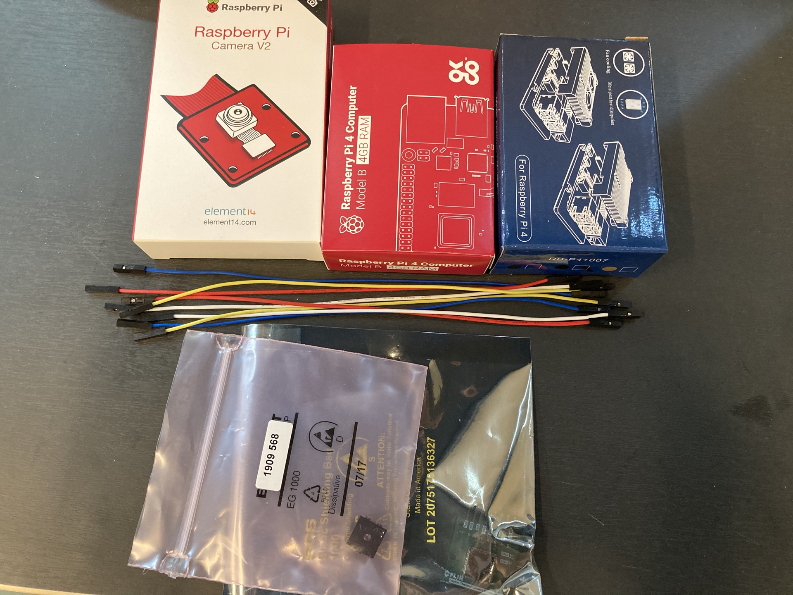

* Raspberry Pi 4
* Raspberry Pi Case or Heatsink
* Raspberry Pi Camera
* Lipton thermal camera
* Jumper cable

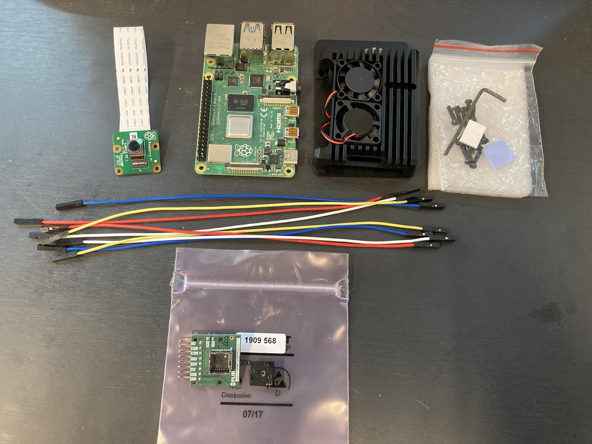

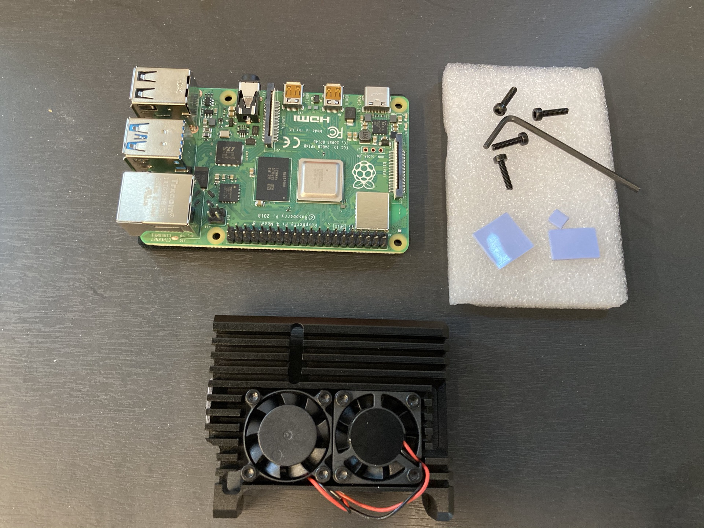

>> Heatsink 의 팬을 고정 합니다.

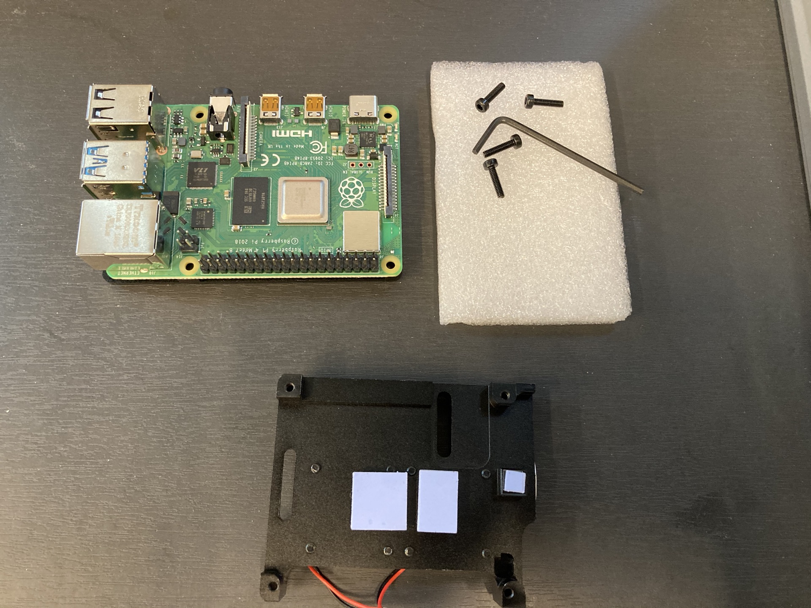

>> Heatsink 뒷면에 써말테잎을 붙입니다.

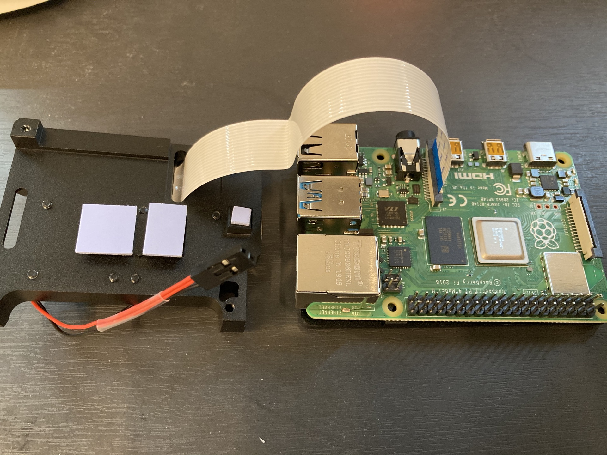

>> Heatsink 를 통과하여 Raspberry Pi Camera 의 케이블을 Raspberry Pi 에 연결 합니다.

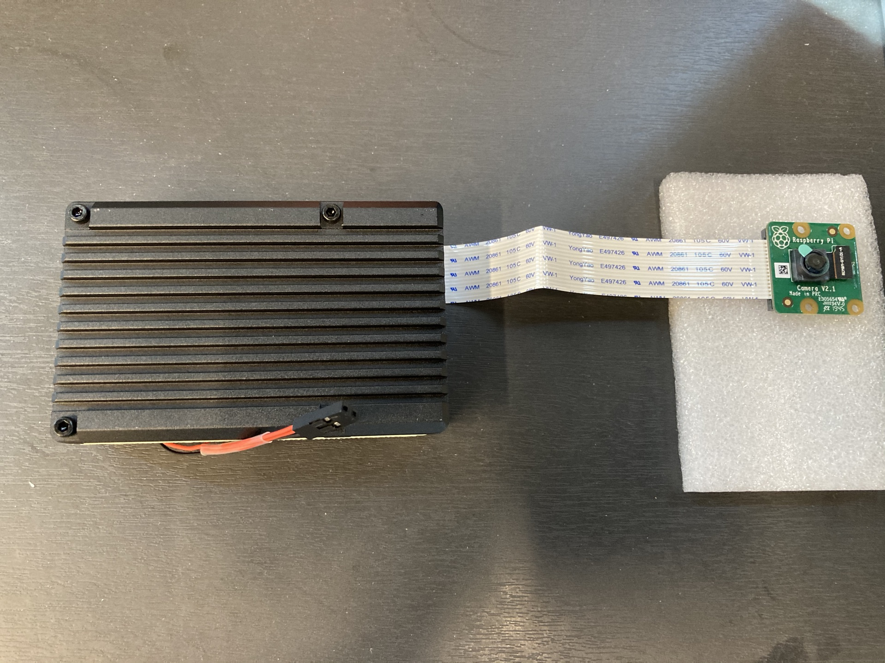

>> Heatsink 를 조립합니다.

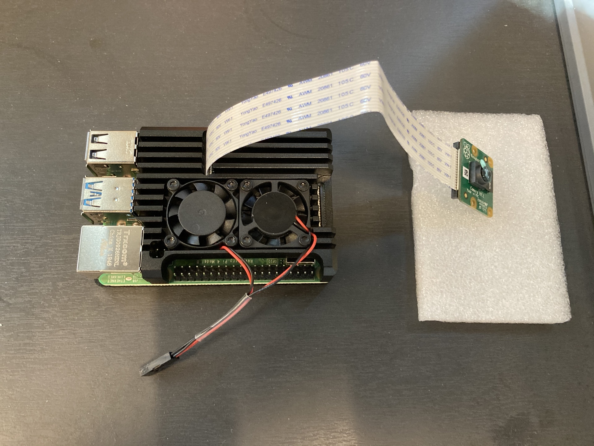

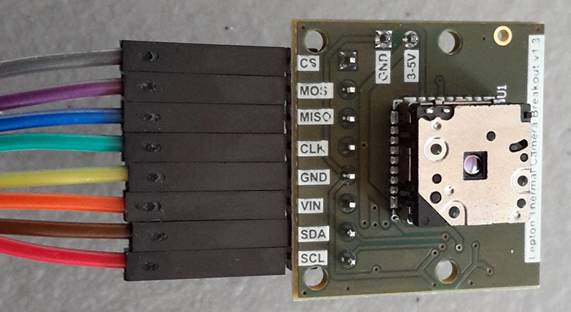

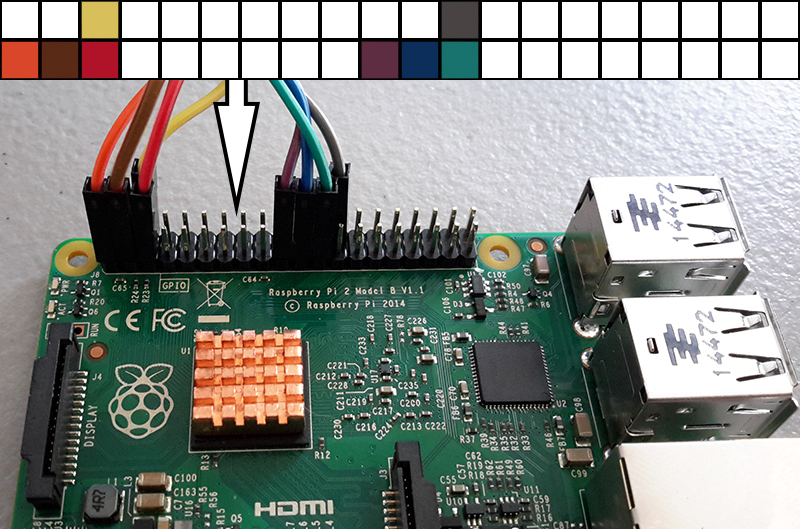

>> 위의 사진을 참조 하여 Jumper cable 을 Lipton thermal camera 와 Raspberry Pi 에 연결 합니다.

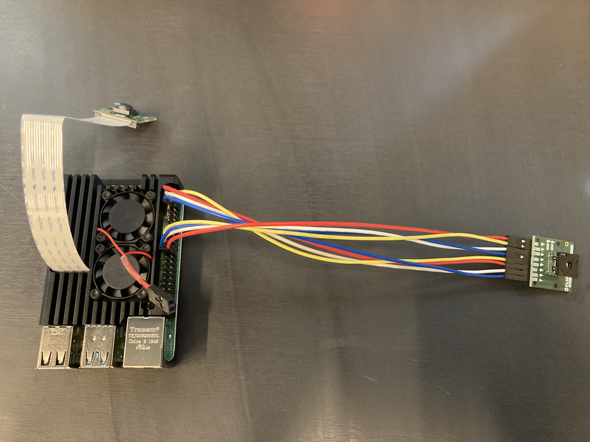

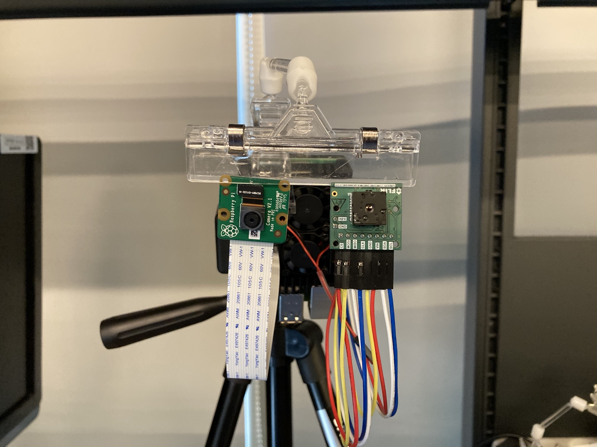

>> 삼각대에 Raspberry Pi, Raspberry Pi Camera, Lipton thermal camera 를 고정 합니다.
